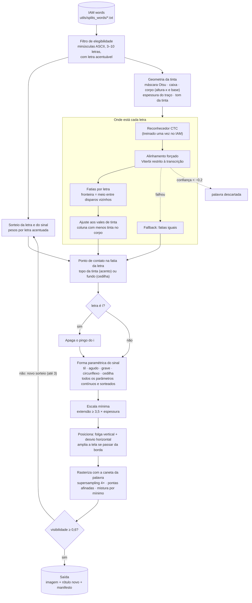

# Acentos sintéticos sobre o IAM

> Parte da série em [`docs/`](README.md). Este documento descreve **o gerador**
> de acentos, etapa por etapa. Como as bases geradas com ele foram usadas no
> treino, e o que deu cada experimento, está em
> [07_experimentos_com_acentos.md](07_experimentos_com_acentos.md).
>
> **Peças acrescentadas depois** da primeira versão deste texto (descritas no
> 07):
> - `gerador.acentuar_palavra`: desenha **todos** os sinais de uma palavra
>   portuguesa, usado na base `iam_pt`;
> - `gerador.par_na_tela`: põe a imagem sem acento na mesma tela da acentuada;
> - `scripts/gerar_base_pt.py`: base de palavras portuguesas geradas pelo
>   DiffusionPen e acentuadas;
> - `scripts/alinhar_pares.py` e `scripts/criar_pares_iam.py`: criam os pares
>   alinhados;
> - `acentos_sinteticos/vocabulario.py`: partição anti-vazamento do
>   vocabulário;
> - `acentos_sinteticos/zona_vogais.py`: máscara das vogais para a loss.

Este documento descreve o pipeline que desenha acentos e cedilhas do português em
palavras manuscritas reais do IAM, trocando também a letra correspondente no rótulo.
Exemplo: a imagem de `can`, com um til desenhado sobre o `a`, vira uma amostra nova
rotulada `cãn`.

**Motivação.**
- O BRESSAY tem os diacríticos, mas a resolução é baixa: cerca de 26 a 31 px de
  altura de palavra (`ACHADOS.md`, seções 7 a 9).
- O RIMES tem boa resolução, mas não tem `ã`, `õ`, `á`, `í`, `ó` nem `ú`.
- O IAM tem boa resolução, mas está em inglês e não tem nenhum diacrítico.

Desenhar o sinal sobre o IAM preserva a resolução, o traço e o estilo de cada
escritor, e ensina a relação "`ã` no texto ↔ til sobre o `a` na imagem".

Código: pacote [`acentos_sinteticos/`](../acentos_sinteticos/). Scripts:
[`scripts/amostras_acentos.py`](../scripts/amostras_acentos.py),
[`scripts/treinar_alinhador.py`](../scripts/treinar_alinhador.py) e
[`scripts/avaliar_posicao_letras.py`](../scripts/avaliar_posicao_letras.py).

---

## Visão geral



Toda a aleatoriedade sai de um único `random.Random(semente)` por amostra. Com a
semente registrada no manifesto, cada amostra é reproduzível exatamente.

---

## Etapa 1 — Palavras elegíveis

`iam.listar()` lê `DiffusionPen/utils/splits_words/<split>`. Cada linha tem o formato
`a01/a01-000u/a01-000u-00-00.png,000,A` (caminho, escritor, transcrição).

Uma palavra entra no sorteio (`elegiveis()` em `amostras_acentos.py`) se cumprir tudo
isto:
- só letras ASCII, todas minúsculas;
- de 3 a 10 letras;
- pelo menos uma letra-base acentuável.

Em `iam_train_val.txt` são 30.658 palavras.

| letra-base | vira |
|---|---|
| a | ã á â à |
| o | õ ó ô |
| e | é ê |
| i | í |
| u | ú |
| c | ç |

## Etapa 2 — Sorteio da letra e do sinal

`gerador.candidatos()` lista os pares (posição, letra acentuada) possíveis na palavra.
Um deles é sorteado com estes pesos (`PESOS_PADRAO`):

| ã | ç | õ | é | ê | á | ó | í | ú | â | ô | à |
|---|---|---|---|---|---|---|---|---|---|---|---|
| 3,0 | 2,0 | 1,5 | 1,5 | 1,0 | 1,0 | 1,0 | 1,0 | 0,8 | 0,7 | 0,7 | 0,5 |

O til pesa mais porque é o diacrítico mais frequente do português e nenhum dataset real
em boa resolução o cobre. O sorteio vem antes de qualquer medição na imagem; por isso, a
mesma semente produz o mesmo sinal com qualquer método de localização das letras.

## Etapa 3 — Geometria da tinta (`geometria.analisar`)

Esta etapa transforma a foto de uma palavra em algumas medidas simples:
- onde está a tinta;
- onde fica o corpo das letras;
- qual a grossura e a cor da caneta.

O resto do pipeline usa essas medidas.

| medida | como | para quê |
|---|---|---|
| máscara de tinta | limiar de Otsu; componentes < 4 px descartados | separar tinta de papel |
| caixa | retângulo que envolve a tinta | início e fim da palavra |
| altura-x e linha de base | faixa contínua do perfil horizontal com ≥ 30% do pico, piso de 3 espessuras | onde o acento encosta; régua de tamanhos |
| espessura do traço | 2 × percentil 90 da transformada de distância | grossura do sinal desenhado |
| tom da tinta | mediana do cinza da tinta | cor do sinal desenhado |

### 3.1 Máscara de tinta por Otsu

**Máscara** é uma imagem de sim ou não, do mesmo tamanho da original: cada pixel é
marcado "tinta" ou "papel".

**O limiar não pode ser fixo.** A foto vem em cinza, de 0 (preto) a 255 (branco), e é
preciso um limiar: abaixo dele é tinta, acima é papel. Cada página do IAM tem papel e
caneta diferentes; numa o papel é 240 e a tinta 60, noutra o papel é 200 e a tinta 120.

**Como o método de Otsu escolhe o limiar:**
- Ele olha o **histograma**: quantos pixels há de cada tom de cinza.
- Numa palavra manuscrita o histograma tem dois "morros": um grande no claro (o papel)
  e um menor no escuro (a tinta).
- Otsu põe o corte no vale entre os dois. Formalmente, escolhe o limiar que deixa cada
  grupo o mais homogêneo possível (mínima variância dentro dos grupos).

```
nº de pixels
  │                         ▄▄
  │                        ████   ← papel
  │   ▄▄                  ██████
  │  ████   ← tinta      ████████
  └──────────────┬──────────────── cinza
  0            limiar           255
```

Se a imagem quase não tem contraste (diferença entre o máximo e o mínimo < 25), a
máscara fica vazia e a palavra é descartada.

### 3.2 Componentes conexos e manchas

**Componente conexo** é um grupo de pixels de tinta que se tocam, inclusive pela
diagonal (vizinhança 8). Uma letra cursiva ligada forma um componente; o pingo do `i`
forma outro, separado.

Componentes com **menos de 4 px** de área são descartados. São poeira, ruído do scanner
ou resto de outra palavra que entrou no recorte. Sem isso, um ponto de sujeira no canto
esticaria a caixa da palavra.

### 3.3 Caixa

A **caixa** (*bounding box*) é o menor retângulo que contém toda a tinta restante. Ela
define onde a palavra começa e termina na horizontal; as fatias iguais, por exemplo,
dividem a largura dela.

### 3.4 Corpo da palavra: altura-x e linha de base

A escrita latina tem três zonas:

```
  ── ascendentes ───   │   │        b d f h k l t sobem aqui
  ────────────────────── altura-x
  ──  corpo  ───────   a c e m n o s u   todas as letras ocupam esta faixa
  ────────────────────── linha de base
  ── descendentes ──    g p q y       descem aqui
```

- **Linha de base:** a linha imaginária onde as letras "pousam".
- **Altura-x:** a altura das letras sem haste, como `x`, `a` e `o`. O nome vem da
  tipografia.
- **Ascendentes e descendentes:** as hastes que sobem acima do corpo (`l`, `t`, `d`) e
  as que descem abaixo da base (`g`, `p`).

Isso importa porque **o acento fica logo acima da altura-x**, sobre o `a` ou o `e`, e
não no topo do `l` vizinho. A cedilha sai da linha de base.

#### O perfil horizontal

O **perfil horizontal** é uma lista com a quantidade de tinta (pixels de tinta) em cada
fileira da imagem. Exemplo com a palavra `ala`, 12 fileiras de altura:

```
fileira  tinta   desenho
   0       2     ▌            ← topo da haste do l
   1       2     ▌
   2       3     ▌
   3       3     ▌
   4      20     ████████████ ← começa o corpo (a, l, a)
   5      25     ██████████████
   6      12     ███████      ← "buraco" de 1 fileira
   7      24     █████████████
   8      22     ████████████
   9      18     ██████████   ← fim do corpo
  10       1     ▏            ← resto do traço
  11       0
```

No corpo todas as letras contribuem, então o perfil é alto. Nas zonas das hastes só
algumas letras contribuem, e o perfil cai.

#### Suavização (janela 3)

A **fileira 6** tem só 12, no meio do corpo. Isso acontece, por exemplo, quando o meio
do `a` é oco naquela altura. Não é o fim do corpo, é um acidente de 1 fileira.

A suavização troca cada valor pela média dele com os dois vizinhos:

```
fileira 6:  (25 + 12 + 24) / 3 = 20,3
```

O buraco vira 20,3 e deixa de parecer o fim do corpo. Um buraco de verdade, de várias
fileiras seguidas, continua aparecendo depois da média, porque os vizinhos também são
baixos.

#### Faixa contínua com 30% do pico

Depois de suavizar, a **fileira mais cheia** (o pico) é a 5, com cerca de 23. O limite é
**30% de 23 ≈ 7**. Partindo da fileira 5:

- **subindo:** a 4 (~16) passa. A 3 (~9, já com a média da 4) passa por pouco. A 2 (~3)
  **não passa**, e a faixa para aqui.
- **descendo:** a 6, a 7, a 8 e a 9 passam. A 10 (~6) **não passa**, e a faixa para.

O corpo vai mais ou menos da fileira 3 à 9: o **topo é a altura-x** e o **fundo é a
linha de base**. A haste do `l` (fileiras 0 a 2) fica de fora.

"**Contínua**" quer dizer que a faixa cresce passo a passo a partir do pico e **para na
primeira fileira que falha**. Uma fileira forte lá longe não entra se houver uma fraca
no caminho.

#### Por que essa regra e não outra

Duas regras anteriores falharam.

**Regra 1: "todas as fileiras com pelo menos 50% do pico".** O problema é o pico. Em
`area`, a pessoa fez um traço horizontal comprido, com o arco do `r` emendado no `e`.
Numa única fileira isso dá uma quantidade enorme de tinta:

```
fileira  tinta
   4      14
   5      15
   6      60   ← traço horizontal comprido: pico artificial
   7      16
   8      14
```

O pico é 60 e o limite de 50% é 30, então só a fileira 6 passa. O "corpo" sai com 1 a
2 fileiras (na imagem real, 8 px), quando o corpo de verdade são as fileiras 4 a 8. Com
uma altura-x minúscula, o acento é desenhado proporcional a ela e sai pequeno, colado
na letra, quase invisível.

**Regra 2: "a faixa que concentra a maior parte da tinta".** A faixa seria o conjunto de
fileiras que, juntas, somam algo como 80% de toda a tinta. Em `life`, o `l` e o `f` têm
**laços grossos** nas hastes, lá em cima:

```
fileira  tinta
   0      10   ← laço do l
   1      12   ← laço do f
   2      11
   3       8
   4      15   ← corpo (i, e, base do f)
   5      16
   6      14
```

Os laços carregam muita tinta. Para somar 80%, a faixa precisa incluí-los, e o "corpo"
vai do topo dos laços até a base: **61 px**, quase a palavra inteira. O acento seria
desenhado acima dos laços, longe da letra.

**A regra nova não cai nisso porque é contínua.** Subindo do pico, ela encontra a
fileira 3 (8, abaixo de 30% de 16, já suavizada) e **para ali**. Não importa quanta
tinta exista acima: ela não pula a fileira fraca.

| regra | ponto fraco |
|---|---|
| 50% do pico, qualquer fileira | um pico artificial (traço comprido) encolhe o corpo |
| faixa da maior parte da tinta | hastes com laços grossos esticam o corpo |
| **faixa contínua, 30% do pico, suavizada** | para no primeiro ponto fraco; o piso (3.6) cobre os casos em que o pico ainda engana |

A detecção em 24 palavras, incluindo `area` e `life`, está em
`saidas/acentos_sinteticos/altura_x.png`.

### 3.5 Espessura do traço: transformada de distância

Queremos a grossura da caneta. Se a pessoa escreveu com traço de 6 px, o acento deve ter
uns 6 px; senão parece feito com outra caneta. A palavra é um emaranhado de curvas, e
não dá para pôr uma régua num único lugar: é preciso medir todos os traços de uma vez,
automaticamente.

A **transformada de distância** escreve, **em cada pixel de tinta**, a **distância até
o papel mais próximo**. Exemplo: um traço horizontal com **6 px de altura**
(`.` = papel):

```
máscara                    transformada de distância
. . . . . . . .            . . . . . . . .
█ █ █ █ █ █ █ █            1 1 1 1 1 1 1 1   ← encostado no papel
█ █ █ █ █ █ █ █            2 2 2 2 2 2 2 2
█ █ █ █ █ █ █ █            3 3 3 3 3 3 3 3   ← meio do traço
█ █ █ █ █ █ █ █            3 3 3 3 3 3 3 3
█ █ █ █ █ █ █ █            2 2 2 2 2 2 2 2
█ █ █ █ █ █ █ █            1 1 1 1 1 1 1 1
. . . . . . . .            . . . . . . . .
```

**Por que "2 ×".** O meio do traço está a **metade da largura** do papel: 3 até o papel
de cima, 3 até o de baixo. Então `espessura ≈ 2 × 3 = 6 px`. Isso vale em qualquer
direção (horizontal, vertical, diagonal, curva), porque a distância é até o papel
**mais próximo**, seja qual for o lado.

**Por que o percentil 90, e não a média nem o máximo.** Nos números do exemplo
(1, 2, 3, 3, 2, 1), a maioria dos pixels **não** está no meio do traço.

- **Média:** (1+2+3+3+2+1) / 6 = 2, o que daria espessura 4 px. **Erra para menos**,
  porque as bordas puxam para baixo.
- **Máximo:** erra para mais. Em cruzamentos de traços (o `t` cortado, um `x`) ou
  borrões onde a caneta parou, a tinta forma um bloco largo e aparecem distâncias 5 ou
  6. O máximo diria que a caneta tem 12 px.

```
cruzamento de dois traços:
    █ █ █ █ █ █
    █ █ █ █ █ █
█ █ █ █ █ █ █ █ █ █
█ █ █ █ █ █ █ █ █ █   ← bloco largo: distância até o papel maior
█ █ █ █ █ █ █ █ █ █
    █ █ █ █ █ █
```

- **Percentil 90:** ordenam-se as distâncias de todos os pixels de tinta e pega-se o
  valor com **90% abaixo e 10% acima**. Ele cai no meio dos traços normais. Os poucos
  exageros de cruzamentos e borrões ficam nos 10% de cima e são ignorados.

```
distâncias ordenadas de uma palavra inteira:
1 1 1 1 1 1 1 1 2 2 2 2 2 2 2 3 3 3 3 3 [3] 5 6
 ←──── bordas ────→ ←─ meio dos traços ─→ ↑   ↑
                               percentil 90   cruzamentos/borrões
```

Resultado: espessura = 2 × 3 = **6 px**. A medição usa a métrica L2 do OpenCV
(`cv2.distanceTransform`, máscara 3) e tem piso de 1 px.

### 3.6 Piso do corpo

Uma letra tem altura-x de **várias vezes** a espessura da caneta; um `a` com corpo de
8 px escrito com caneta de 6 px seria um borrão. Se o corpo medido der menos que
**3 espessuras**, ele é ampliado até esse mínimo, metade para cima e metade para baixo,
sem sair da caixa. É a rede de segurança para quando o perfil engana.

### 3.7 Tom da tinta

É a **mediana** do cinza dos pixels de tinta, o valor do meio quando eles são
ordenados. A mediana não é afetada pelas bordas claras, que são meio tinta, meio papel.
O sinal é pintado num tom sorteado entre 0,9 e 1,1 vezes esse valor (Etapa 7).

### Por que tudo é medido em altura-x

Com essas medidas, o resto do pipeline é proporcional à própria palavra: tamanho do
sinal, folga entre acento e letra, deslocamento lateral. Palavra escrita grande recebe
acento grande; palavra pequena, acento pequeno. Com valores em pixels fixos, o mesmo
til ficaria enorme numa palavra miúda e invisível numa grande.

---

## Etapa 4 — Onde está cada letra

A pergunta desta etapa é: **em que pedaço da imagem está a letra que vai receber o
acento?** A transcrição é conhecida ("for"), mas não se sabe onde o `o` está desenhado.

### 4.0 O problema das fatias iguais

A primeira versão dividia a largura da palavra em partes iguais, uma por letra:

```
palavra "for", 90 px de largura → 3 fatias de 30 px

 |   f    |   o    |   r    |
 0       30       60       90
```

Isso funciona quando as letras têm larguras parecidas. Na escrita real:

```
 |  f  f  f  f  f  f   | o  |r |
 0                    60   80 90
       f ocupa 60 px     o: 20 px

fatias iguais:  |  f   |  o   |  r  |
                0      30     60    90
                         ↑
           a fatia do "o" (30–60) está em cima do f
```

O til sairia sobre o `f`, como aconteceu com `fõr` na primeira versão. É preciso algo que
**olhe a imagem** e diga onde está cada letra.

### 4a. O reconhecedor CTC: lê a palavra em colunas

Um reconhecedor do tipo **CTC** (*Connectionist Temporal Classification*) lê a imagem
**da esquerda para a direita**, em fatias estreitas chamadas **quadros**. No nosso, cada
quadro tem **4 px** de largura, depois que a palavra é normalizada para 64 px de altura.

Para **cada quadro**, ele dá a probabilidade de cada caractere estar ali. Há também um
caractere especial, o **branco** (`-`). Ele quer dizer "aqui não começa letra nenhuma":
é meio de letra, ligação ou espaço.

Exemplo simplificado para "for", com 10 quadros:

```
quadro:     1    2    3    4    5    6    7    8    9    10
           ───────── f ──────────── │ ── o ── │ ─ r ─
P(f)       .1   .8   .3   .1   .1   .0   .0   .0   .0   .0
P(o)       .0   .0   .0   .1   .1   .1   .7   .2   .0   .0
P(r)       .0   .0   .0   .0   .0   .0   .0   .1   .8   .1
P(-)       .9   .2   .7   .8   .8   .9   .3   .7   .2   .9
```

É um comportamento típico do CTC: **a letra "acende" em um ou dois quadros** (o `f` no
2, o `o` no 7, o `r` no 9), e no resto o modelo diz "branco". O quadro em que a letra
acende é o **disparo** dela.

**Por que o branco existe.** A leitura livre junta repetições e depois tira os brancos:

```
f f - - - o o - r -   →   junta repetidos   →   f - o - r -   →   tira brancos   →   "for"
```

Para escrever `ll` (em "hello"), precisa haver um branco entre os dois `l`: `l - l`. Sem
ele, `l l` viraria um `l` só.

**Como ele aprende.** O treino mostra 47.981 palavras do IAM com a transcrição, sem
nunca dizer onde ficam as letras. O modelo aprende sozinho a acender cada letra perto
dela, porque é o jeito mais fácil de acertar a leitura.

#### Arquitetura

| item | valor |
|---|---|
| entrada | palavra em cinza invertido (tinta = 1), altura 64 px, largura proporcional e múltipla de 4 (máx. 1024) |
| CNN 2D | 6 convoluções 3×3 (64→128→256→256→256→256) com BN e ReLU; pooling reduz a altura de 64 para 4 e a largura para 1/4 |
| cabeça | 4 Conv1d (k = 5) sobre a sequência de quadros, dropout 0,2, Conv1d 1×1 para as classes |
| saída | log-probabilidades (T × 79): 78 caracteres do IAM + branco; **1 quadro = 4 px** da imagem normalizada |
| perda | CTC (branco = 0) |

#### Por que só convolucional (sem LSTM)

**LSTM** (*Long Short-Term Memory*) é um tipo de rede feito para ler **sequências** um
elemento por vez, guardando uma **memória** do que já viu.

Uma analogia: ler a palavra com uma lanterna que ilumina uma coluna por vez, da esquerda
para a direita.

- **Só convolução:** em cada coluna você enxerga o que a lanterna ilumina, mais um
  pouco ao redor. Para decidir se ali há um `o`, você só usa o que está perto.
- **LSTM:** enquanto anda, você anota num caderninho ("já passei por um `f`", "a pessoa
  escreve inclinado"). Em cada coluna, decide olhando a lanterna **e** o caderninho.

```
coluna:      1     2     3     4     5       6     7 ...
              ↓     ↓     ↓     ↓     ↓       ↓     ↓
memória:  [ ] → [f?] → [f] → [f] → [f,o?] → [f,o] → ...
              a memória passa de uma coluna para a próxima
```

O nome vem dos **portões** internos, que decidem a cada passo o que **guardar**, o que
**esquecer** e o que **usar** da memória. Isso deixa a rede lembrar de coisas de muitos
passos atrás. Uma **LSTM bidirecional** são duas LSTMs, uma da esquerda para a direita e
outra da direita para a esquerda. Em cada coluna ela sabe o que veio antes **e depois**,
ou seja, conhece a palavra inteira.

**Para ler, isso ajuda muito.** O contexto resolve letras ambíguas. Por isso o modelo
clássico de reconhecimento de escrita (CRNN) é convolução + LSTM bidirecional + CTC.

**Para localizar, atrapalha.** Se cada coluna "sabe" a palavra inteira, o modelo pode
acender o `o` um pouco antes ou depois de onde ele está desenhado e ainda ler certo. A
perda CTC só cobra a **ordem** das letras, não o **lugar** em que acendem.

```
só convolução:   cada coluna vê ~2–3 letras ao redor
                 → para acender o "o", precisa estar perto do "o"

com LSTM:        cada coluna vê a palavra inteira
                 → pode acender o "o" deslocado e ainda acertar a leitura
```

O alinhador lê pior do que um CRNN com LSTM: CER 0,127, contra cerca de 0,05–0,08 que é
típico no IAM. Mas o disparo de cada letra fica **perto da letra**, que é o que importa
aqui.

#### Treino (`scripts/treinar_alinhador.py`)

- **Dados:** `iam_training.txt` (47.981 palavras); validação em `iam_val.txt` (7.554).
- **Otimização:** AdamW com lr 1e-3, OneCycle, batch 64, clip 5, 15 épocas.
- **Aumento de dados:** largura esticada entre 0,8 e 1,2.
- **Lotes:** agrupados por largura parecida, com a largura do lote arredondada para
  múltiplos de 128 px. Cada formato novo de entrada faz o MIOpen (ROCm) recompilar
  kernels.
- **Resultado:** cerca de 103 s por época na RX 9060 XT. Melhor CER de validação
  **0,127**, na época 14, com 62% das palavras lidas certas.
- **Pesos:** `modelos/alinhador_iam.pt` (gitignored), reconstruídos pelo comando acima.

### 4b. Alinhamento forçado: "eu já sei o que está escrito" (`alinhamento.viterbi_ctc`)

Lendo livremente, o modelo pode errar: em `for` ele lê "fo". Mas a resposta certa já é
conhecida, então a pergunta muda de *"o que está escrito?"* para:

> **"Sabendo que está escrito f-o-r, em que quadro está cada letra?"**

Isso é o **alinhamento forçado**: considerar **todos os caminhos possíveis** que soletram
exatamente "for" e escolher o mais provável. Um **caminho** é uma escolha de símbolo por
quadro que, depois de juntar repetidos e tirar brancos, vira "for":

```
quadro:   1  2  3  4  5  6  7  8  9  10
A:        -  f  -  -  -  -  o  -  r  -     ✓ soletra "for"
B:        f  f  f  -  o  o  o  -  r  r     ✓ soletra "for"
C:        -  f  -  o  -  -  -  -  r  -     ✓ soletra "for"
D:        -  f  -  -  -  -  r  -  o  -     ✗ soletra "fro", não vale
```

A probabilidade de um caminho é o produto das probabilidades de cada quadro. Com a tabela
da 4a:

```
caminho A:  .9 × .8 × .7 × .8 × .8 × .9 × .7 × .7 × .8 × .9   ≈ 0,07
caminho C:  .9 × .8 × .7 × .1 × ...                            ≈ 0,008  ("o" no quadro 4 é improvável)
```

O caminho A vence: **f no quadro 2, o no 7, r no 9**.

O **algoritmo de Viterbi** acha o vencedor sem testar os caminhos um a um, o que seria
impossível com muitos quadros. Ele avança quadro a quadro guardando, para cada posição
no texto, a melhor forma de ter chegado ali. As posições são "no branco antes do f",
"no f", "no branco depois do f", "no o" etc.: 2N + 1 estados para N letras. As regras
de movimento entre quadros:

- **ficar** no mesmo estado (`f f`, `- -`);
- **avançar** para o seguinte (`f → -`, `- → o`);
- **pular o branco** entre duas letras **diferentes** (`f → o` direto). Entre letras
  iguais (`l → l`) não pode, pela regra do branco acima;
- o caminho termina na última letra ou no branco final.

Se a imagem for estreita demais (menos quadros do que o rótulo exige), não há caminho, e
a função devolve `None`.

**De quadro para pixel.** O disparo de cada letra é o centro dos quadros em que o caminho
ocupa o estado dela. Somando 0,5 e multiplicando por 4 px, a posição sai na imagem
normalizada, e depois é convertida para a escala da imagem original.

**Confiança (`logp_medio`).** É a log-probabilidade do caminho vencedor dividida pelo
número de quadros. Numa imagem legível, as letras acendem com força e o valor fica perto
de 0. Numa ilegível, como `fõr`, nenhum caminho é bom e o valor cai (−0,29). Por isso
ele serve de filtro.

O alinhamento também devolve `leitura`, a leitura livre (gulosa) do modelo. A
implementação é em numpy puro, porque o torchaudio não está instalado e instalá-lo
mexeria no ambiente do treino.

### 4c. De disparos para fatias (`alinhamento.fatias_do_alinhamento`)

Agora há **um ponto por letra**, mas o resto do pipeline precisa de uma **fatia** por
letra: um intervalo da esquerda para a direita.

**Usar o disparo direto como centro não funciona.** Medido (veja a Avaliação), o disparo
cai, em mediana, **0,23 largura de letra à direita do centro**. O modelo tende a acender
a letra quando já viu a maior parte dela:

```
        ┌── letra "o" ──┐
        │       ●   ↑   │
        │     centro  disparo
```

Um acento posto no disparo ficaria puxado para a direita, quase na letra seguinte.

**Solução: fronteira no meio entre disparos vizinhos.** As pontas são a caixa da tinta:

```
disparos:      f●              o●         r●
               10              55         80

fronteiras:  0 ──────── 32,5 ─────── 67,5 ──── 90
                  f           o            r
             (início      (meio entre  (meio entre      (fim
             da caixa)     10 e 55)     55 e 80)       da caixa)
```

Como todos os disparos estão deslocados para o mesmo lado, o meio entre dois deles cai
perto da fronteira real entre as letras, e o deslocamento quase se cancela: o desvio
mediano vai de +0,23 para +0,03 de letra.

### 4d. Ajuste ao vale de tinta (`geometria.ajustar_aos_vales`)

**Entre duas letras quase sempre há pouca tinta:** na cursiva, só a ligação fina; em
letras soltas, papel branco. O ajuste olha o **perfil vertical** dentro do corpo da
palavra, isto é, quanta tinta há em cada **coluna** (suavizado com janela 3):

```
tinta por coluna (só dentro do corpo):

       █         █ █ █           █ █
     █ █ █     █ █ █ █ █       █ █ █ █
   █ █ █ █ █ ▁ █ █ █ █ █ █ ▁ ▁ █ █ █ █ █
   ───── f ─────── o ───────── r ─────
              ↑                 ↑
            vale              vale
           (pouca tinta = ligação entre letras)
```

Cada fronteira interna se move para a **coluna com menos tinta** numa janela de
**±0,25 × a largura média das fatias** em volta dela. Em caso de empate, vale a coluna
mais próxima da fronteira original. A janela é pequena de propósito: o ajuste refina a
fronteira, mas não deixa ela fugir para um vale longe dali.

```
antes:   |    f     |  o   |  r  |
                    ↑ fronteira caiu no meio do "o"
depois:  |    f   |   o    |  r  |
                  ↑ foi para o vale à esquerda
```

### 4e. Plano B

Se não houver alinhador carregado, ou o alinhamento falhar (palavra estreita demais,
caractere fora do alfabeto), o gerador volta às **fatias iguais**. O manifesto registra
o método em `params.segmentacao`: `ctc_vale` ou `igual`.

### Quanto cada passo ajudou

Medido em 2.969 letras cuja posição é conhecida (detalhes na seção Avaliação):

| método | acerta a letra | nas letras do meio |
|---|---|---|
| fatias iguais | 92,6% | 89,1% |
| + CTC (fronteira no meio dos disparos) | 97,8% | 97,1% |
| + ajuste ao vale | **98,0%** | **97,3%** |

A maior parte do ganho vem do CTC, que acerta "mais ou menos onde". O vale faz o ajuste
fino e reduz o desvio em relação ao centro da letra.

**Em uma frase:** um modelo treinado para ler o IAM diz, coluna por coluna, que letra
parece estar ali. Como o texto é conhecido, acha-se o jeito mais provável de encaixar
"f-o-r" nessas colunas. Isso dá um ponto por letra; as fronteiras ficam no meio entre
os pontos e são empurradas para a coluna com menos tinta.

## Etapa 5 — Ponto de contato (`geometria.contato_superior` / `contato_inferior`)

Dentro da fatia da letra escolhida:
- **x:** o centroide da tinta do corpo dentro da fatia, ponderado por coluna.
- **y, acentos:** a primeira fileira com tinta, de cima para baixo, nos 60% centrais da
  fatia.
  - A busca não começa acima de `altura-x − 0,15 × altura-x`. Assim ela não pega a
    ascendente de uma letra vizinha que invade a fatia.
- **y, cedilha:** a última fileira com tinta, nos 60% centrais da fatia.
  - A busca não desce abaixo de `base + 0,15 × altura-x`.

**Caso do `í`** (`geometria.pingos_do_i`): componentes pequenos (área ≤ 0,35 ×
altura-x²) inteiramente acima da altura-x, com centro dentro da fatia, são o pingo.
Eles são apagados por *inpainting* (`cv2.inpaint`, Telea), que preenche a área com o
papel em volta, antes de o agudo ser desenhado. A área é dilatada em 1 px para não
sobrar sombra da borda. Pintar com uma cor só deixava um quadrado mais claro em papel
com textura.

## Etapa 6 — Forma do sinal (`tracos.py`)

Cada forma é uma curva paramétrica com todos os parâmetros **contínuos e sorteados**,
então dois sinais do mesmo tipo nunca saem iguais. As faixas são proporcionais à
altura-x (`ref`).

| sinal | construção | parâmetros sorteados |
|---|---|---|
| til | onda senoidal, girada | largura 0,75–1,25·ref · amplitude 0,08–0,20·ref · ciclos 0,8–1,2 · fase ±0,35 · assimetria entre lobos ±0,35 · inclinação −0,30 a +0,20 rad |
| agudo / grave | Bézier quadrática subindo para a direita (agudo) ou para a esquerda (grave) | comprimento 0,40–0,75·ref · ângulo 40–75° · curvatura ±0,18 (flecha/comprimento) |
| circunflexo | V invertido: dois braços Bézier + ápice arredondado | largura 0,55–0,95·ref · altura 0,25–0,45·ref · desvio do ápice ±0,15 · razão entre braços 0,8–1,2 · arredondamento 0–0,35 · curvatura dos braços ±0,12 |
| cedilha | Bézier cúbica que desce, abre a barriga e volta para a esquerda | tamanho 0,35–0,60·ref · desvio da descida −0,10 a 0,15 · barriga 0,40–0,85 · volta 0,10–0,50 · profundidade 0,85–1,15 |

Ponto de encaixe (a origem da forma):
- acentos: o meio da borda de baixo do sinal;
- cedilha: o ponto em que ela sai da letra.

## Etapa 7 — Escala, posição e tela (`gerador.acentuar`)

| parâmetro | faixa sorteada | unidade |
|---|---|---|
| espessura do sinal | 0,60–1,00 × espessura da palavra | px |
| tom do sinal | 0,90–1,10 × tom da palavra (limitado a 0–200) | cinza |
| folga vertical (acentos) | 0,10–0,35 × altura-x, + meia espessura | px acima do contato |
| desvio horizontal | −0,10 a +0,10 × altura-x | px |
| cedilha | nasce 0,3 espessura *dentro* da letra, para encostar | px |

- **Escala mínima:** se a maior dimensão do sinal for menor que 3,5 × a sua espessura,
  o sinal é ampliado por igual, a partir do ponto de encaixe. Sem isso, com caneta
  grossa, um agudo curto vira uma gota que parece pingo (`make` com traço de 7 px).
- **Tela:** o IAM corta justo no topo. Se o sinal, mais uma margem de espessura + 2 px,
  passar de alguma borda, a imagem ganha margem com a cor do papel. A cor do papel é a
  mediana dos 40% de pixels mais claros. As margens ficam em `params.margens`.

## Etapa 8 — Rasterização (`desenho.desenhar`)

- O traço é desenhado numa camada 4× maior (supersampling) e reduzido com Lanczos. Isso
  dá borda suave, como a de uma digitalização.
- A largura afina nas pontas: `espessura × (1 − 0,45 + 0,45·sen(π·t))`, como a pressão
  da caneta.
- A tinta é misturada pelo **mínimo** com a imagem. Onde já há tinta mais escura, ela
  prevalece, e o sinal se cruza com as letras sem clarear nada.

## Etapa 9 — Saída

`gerador.Amostra` contém:
- a imagem em uint8;
- o rótulo novo: `palavra[:i] + letra + palavra[i+1:]`;
- o índice, a letra e o tipo do sinal;
- `params`, com todos os valores sorteados mais `segmentacao`, `logp_alinhamento` e
  `leitura_alinhador`;
- campos de depuração: fatias, contato e corpo, em coordenadas da imagem final.

`scripts/amostras_acentos.py` grava:

| arquivo | conteúdo |
|---|---|
| `amostras/NNN_<rótulo>.png` | cada amostra |
| `manifesto.jsonl` | uma linha por amostra: arquivo, caminho no IAM, escritor, semente e `params` |
| `amostras.png` | original \| acentuada \| depuração (fatias em cinza, fatia escolhida em amarelo, corpo em azul, contato em vermelho) |
| `variacoes.png` | a mesma palavra e a mesma letra com 6 sementes, por tipo de sinal |
| `comparacao_fatias.png` | com `--alinhador`: a mesma amostra com fatias iguais e com CTC + vales |

## Etapa 10 — Filtros de qualidade (`gerador.gerar`)

`gerar()` é a versão de `acentuar()` usada para montar a base. Ela aplica dois filtros:

1. **Confiança do alinhamento.** Se `logp_medio < −0,2` (`MIN_LOGP`), a palavra inteira
   é descartada (motivo `confianca`). Isso acontece antes de desenhar, porque um
   alinhamento ruim indica um recorte ambíguo ou ilegível, como o `fõr`. Se o
   alinhamento falhar, o motivo é `sem_alinhamento`; na base não há fallback para
   fatias iguais.
2. **Visibilidade do sinal.** Depois de desenhar, mede-se quanto do sinal virou tinta
   **nova** (`desenho.visibilidade`). Se ficar abaixo de 0,6 (`MIN_VISIBILIDADE`), a
   palavra é sorteada de novo (letra, forma e posição) até 3 vezes (`TENTATIVAS`).
   Depois disso, é descartada (motivo `invisivel`).

**Por que medir a visibilidade.** A tinta é misturada pelo mínimo (Etapa 8). Se o sinal
cai em cima de um traço que já existe, como o corte do `t` ou o laço do `h`, ele some
dentro dele. A amostra ganha o rótulo `strêwn` sem acento visível na imagem, e isso
ensina ao modelo exatamente o erro que o trabalho estuda.

**Como a visibilidade é medida:**
- **pixels novos:** os que passaram a ficar mais escuros que o meio entre o papel e a
  tinta, e que não eram tinta antes. A tinta antiga é dilatada em 1 px, para não contar
  a borda suavizada das letras;
- **área esperada:** comprimento da polilinha do sinal × espessura;
- **visibilidade:** pixels novos ÷ área esperada. Perto de 1, o sinal inteiro apareceu;
  perto de 0, ficou escondido.

**Calibração do limiar 0,6.** As mesmas 200 amostras julgadas (seção "Avaliação visual
de 200 amostras") foram refeitas com a mesma semente, que gera imagens idênticas, e a
visibilidade foi cruzada com o julgamento:
- os 4 sinais escondidos em tinta existente (`fór`, `hàs`, `strêwn`, `sidê`) têm
  visibilidade 0,33–0,54;
- das 182 amostras boas, só 1 fica abaixo de 0,6: `perfõrm`, com 0,42 e um til
  minúsculo;
- as outras boas estão todas acima de 0,68 (mediana 0,91).

O valor fica em `params.visibilidade`, e o número da tentativa que passou em
`params.tentativa`.

---

## Avaliação da localização das letras

`scripts/avaliar_posicao_letras.py` monta uma **verdade automática**. Entram palavras
de `iam_val` e `iam_test`, fora do treino do alinhador, que cumpram tudo isto:
- o número de componentes conexos significativos (área ≥ 3% do maior) é igual ao número
  de letras;
- os componentes estão em ordem da esquerda para a direita, com sobreposição em x de no
  máximo 20% da menor letra;
- a palavra não tem `i` nem `j`, porque o pingo seria um componente a mais.

Nessas palavras, cada componente é uma letra e sua caixa é a posição verdadeira.

Resultado em 2.017 palavras e 2.969 letras-alvo (`a o e u c`):

| estimador | acerto (todas) | primeira | meio | última | viés mediano* |
|---|---|---|---|---|---|
| fatias iguais | 92,6% | 99,6% | 89,1% | 97,6% | −0,06 |
| iguais + vales | 94,9% | 99,6% | 92,5% | 98,5% | −0,05 |
| CTC (meio entre disparos) | 97,8% | 98,8% | 97,1% | 99,0% | +0,03 |
| **CTC + vales (em uso)** | **98,0%** | 99,2% | **97,3%** | 99,3% | **−0,04** |
| disparo CTC direto | 98,6% | 99,0% | 98,1% | 99,7% | +0,23 |

\* (x do contato − centro da letra) / largura da letra.

- **Acerto** é o x do contato cair dentro da caixa da letra certa.
- O disparo direto acerta um pouco mais, mas cai sistematicamente no lado direito da
  letra. Um acento ali parece pertencer à letra seguinte.
- **Confiança como filtro:** no quartil inferior de `logp_medio` (≤ −0,05) o acerto do
  CTC é 94,1%. Nos três quartis superiores, fica em 98,5% ou mais. Com leitura livre
  igual ao rótulo, o acerto é 99,0%; com leitura diferente, 95,2%.
- **Ressalva:** letras soltas são o caso fácil. Na escrita cursiva o erro é maior, e
  esse número é um limite inferior.

## Avaliação visual de 200 amostras

200 amostras novas (`--n 200 --seed 1`), de palavras de `iam_train_val`, em sua maioria
cursivas. O julgamento foi feito pelo Claude, um avaliador só, sem ver a confiança, em
folhas de 25 (`saidas/acentos_sinteticos/avaliacao_200/revisao/`). Cada amostra, com o
motivo do julgamento, está em `avaliacao_200/julgamento.tsv`.

| julgamento | n | % (199 julgáveis) |
|---|---|---|
| C — sinal na letra certa | 182 | 91,5% |
| E — sinal na letra errada | 7 | 3,5% |
| F — sinal fraco ou invisível | 10 | 5,0% |
| ? — não julgável (rótulo do IAM errado: `person`, imagem `people`) | 1 | — |

**Corte por confiança:**

| corte de `logp` | fica | C | E | descartados (E / F / C) |
|---|---|---|---|---|
| nenhum | 199 | 91,5% | 3,5% | — |
| **−0,2 (em uso)** | 193 (97%) | 93,3% | 2,1% | 3 / 1 / 2 |
| −0,1 | 184 (92%) | 92,9% | 2,2% | 3 / 1 / 11 |
| −0,05 | 158 (79%) | 94,3% | 1,3% | 5 / 3 / 33 |
| −0,03 | 118 (59%) | 96,6% | 0% | 7 / 6 / 68 |

O corte em −0,2 pega 3 dos 7 erros perdendo só 2 amostras boas. Os outros 4 erros têm
`logp` entre −0,06 e −0,03, no meio das boas, e nenhum corte os separa sem descartar
muitas amostras boas.

**Revisão dos sinais fracos.** Ampliados, 6 dos 10 "F" (5 com `í` e o `bút`) têm o
sinal visível: na escala do modelo, com a palavra reduzida para 64 px de altura, ele tem
1,8 a 4,6 px de espessura. Eles pareciam fracos porque as folhas de 25 mostram palavras
de caneta fina muito reduzidas; o erro foi da escala de visualização, não do gerador.
Os 4 realmente invisíveis estavam escondidos em tinta existente, e o filtro de
visibilidade (Etapa 10) os elimina.

**Padrão nos erros de letra:** 3 dos 7 (`háppens`, `hélp`, `húll`) são a letra logo
depois de um `h`, com o sinal caindo na haste dele.

## A base gerada

`scripts/gerar_base_acentos.py` com seed 0, sobre `iam_train_val`. O `iam_test` fica
fora, para avaliação.

| item | valor |
|---|---|
| palavras elegíveis | 30.658 |
| amostras geradas | **29.732 (97,0%)** de 339 escritores |
| descartadas por confiança < −0,2 | 771 (2,5%) |
| descartadas por sinal invisível (3 sorteios) | 155 (0,5%) |
| precisaram de 2 ou 3 sorteios | 357 |
| tamanho | 233 MB, 125 s com 16 processos |

Letras: é 6.228 · ã 4.881 · ê 4.121 · í 3.261 · õ 2.666 · ó 1.642 · á 1.598 · ç 1.197 ·
ô 1.158 · â 1.107 · ú 1.076 · à 797. A proporção segue os pesos do sorteio e as letras
disponíveis no inglês; o `é` lidera porque o `e` é a letra mais comum.

A base fica fora do git (`iam_acentuado/`). O resumo está em
`saidas/acentos_sinteticos/base/resumo.json`, e uma conferência de 25 amostras
aleatórias em `base/conferencia_25.png`.

Saída: `imagens/NNNNNN.png`, `split.txt` (`imagens/NNNNNN.png,escritor,rótulo`, no
formato dos `utils/splits_words/*.txt`), `manifesto.jsonl`, `descartes.tsv` e
`resumo.json`.

## Uso no fine-tune

O `train.py` lê a base com `--dataset iam_acentuado`
(`diffusionpen_mods/utils/iam_acentuado_dataset.py`). O experimento é
`experimentos/iam_acentuado.json`:

```bash
python scripts/treinar.py experimentos/iam_acentuado.json
```

- **Amostras de treino:** as 29.732 acentuadas e a fração `dados.iam_originais` das
  55.535 palavras originais de `iam_train_val`, sem acento. Com 1,0, são 85.267
  amostras, 35% delas acentuadas. As originais mantêm a distribuição em que o modelo
  foi treinado, o que reduz o esquecimento. Também evitam que ele aprenda "sempre ponha
  algum acento". E, como cada acentuada saiu de uma original, o par "mesma imagem, com
  e sem o sinal" é o contraste mais direto possível.
- **Referências de estilo:** 5 palavras originais, sem acento, do mesmo escritor, com
  mais de 3 letras (o mesmo critério do `IAMDataset`). O extrator de estilo vê a
  caligrafia; o acento só pode vir do texto.
- **Pré-processamento:** o do `IAMDataset`, copiado sem mudança. A palavra vai para
  altura 64 mantendo a proporção e é centralizada em 256 de largura, sem normalização
  de contraste. É o que o modelo viu no treino original.
- **Classe do escritor:** o índice de `writers_dict_train.json`, o mesmo do treino do
  IAM. O escritor `000` é a classe 12, o estilo usado na sonda.
- **Amostras de cada bloco:** pares sem e com acento (`nacao`/`nação`,
  `coracao`/`coração`, `pao`/`pão`, `avo`/`avó`, `voce`/`você`) e o controle `the`, com
  estilos do IAM.

## Limitações conhecidas

- **Cursiva muito ligada:** em `stumblêd` o circunflexo cai sobre o `d`. O alinhador lê
  "stumblerd", e a confiança não é das mais baixas, então o filtro não o pega.
- **Recortes quase ilegíveis:** `fõr` tem `logp` −0,29 e o alinhador lê "fo". O filtro
  de confiança (−0,2) descarta esses casos.
- **Letra depois de um `h`:** o sinal pode cair na haste do `h` (3 dos 7 erros na
  avaliação de 200). O filtro não pega esses casos.
- **Erros residuais:** cerca de 2% dos sinais na letra vizinha, com confiança alta.
- **Rótulos errados do próprio IAM** passam adiante (1 em 200).
- **Cedilha** sob um `C` grande se mistura com a curva da letra.
- O acento é **sempre um traço separado**. Escritores que ligam o acento à letra seguinte
  não são imitados.

## Como reproduzir

Todos os comandos rodam a partir da raiz do repositório, no ambiente com GPU.

```bash
# 1. treinar o alinhador (uma vez; ~27 min na RX 9060 XT)
python scripts/treinar_alinhador.py --epocas 15 --saida modelos/alinhador_iam.pt

# 2. medir a localização das letras
python scripts/avaliar_posicao_letras.py --alinhador modelos/alinhador_iam.pt

# 3. folhas de amostras (sem --alinhador: fatias iguais)
python scripts/amostras_acentos.py --n 30 --seed 0 --alinhador modelos/alinhador_iam.pt

# 4. base completa (iam_train_val, com os filtros; ~30 min com 16 processos)
python scripts/gerar_base_acentos.py --alinhador modelos/alinhador_iam.pt --saida iam_acentuado --workers 16
```

Uso como biblioteca:

```python
import random
from acentos_sinteticos import alinhamento, gerador, iam

alin = alinhamento.Alinhador("modelos/alinhador_iam.pt")      # CPU basta
p = iam.listar("DiffusionPen")[0]
am, motivo = gerador.gerar(iam.carregar_cinza(p.caminho), p.texto,
                           random.Random(123), alin)           # com os filtros
if am is not None:                                             # motivo == "ok"
    am.imagem, am.rotulo, am.manifesto()
```

## Mapa dos arquivos

| arquivo | papel |
|---|---|
| `acentos_sinteticos/iam.py` | lista as palavras do IAM e lê as imagens |
| `acentos_sinteticos/geometria.py` | máscara, caixa, corpo, espessura, fatias iguais, ajuste aos vales, pontos de contato, pingo do i |
| `acentos_sinteticos/alinhamento.py` | modelo CTC, Viterbi forçado, `Alinhador`, fatias do alinhamento |
| `acentos_sinteticos/tracos.py` | formas paramétricas dos cinco sinais |
| `acentos_sinteticos/desenho.py` | rasterização, cor do papel, apagar (inpainting), ampliar tela, visibilidade |
| `acentos_sinteticos/gerador.py` | orquestra: sorteio, localização, contato, forma, posição, desenho, rótulo; `gerar()` com os filtros |
| `scripts/treinar_alinhador.py` | treino do reconhecedor CTC |
| `scripts/avaliar_posicao_letras.py` | verdade automática e comparação dos estimadores |
| `scripts/amostras_acentos.py` | folhas de avaliação visual e manifesto |
| `scripts/gerar_base_acentos.py` | base completa: imagens, `split.txt`, manifesto, descartes, resumo |
| `diffusionpen_mods/utils/iam_acentuado_dataset.py` | leitor da base para o `train.py` (`--dataset iam_acentuado`) |
