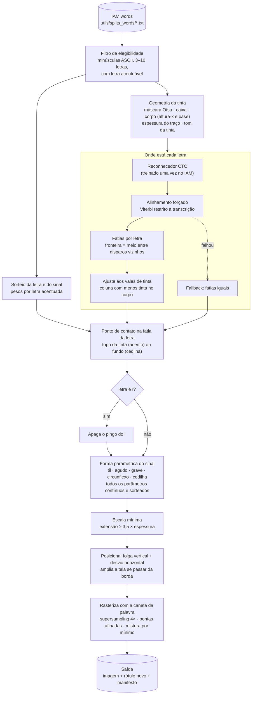

# Acentos sintéticos sobre o IAM

Este documento descreve o pipeline que desenha acentos e cedilhas do português em
palavras manuscritas reais do IAM, trocando também a letra correspondente no rótulo.
Exemplo: a imagem de `can`, com um til desenhado sobre o `a`, vira uma amostra nova
rotulada `cãn`.

**Motivação.**
- O BRESSAY tem os diacríticos, mas a resolução é baixa: cerca de 26 a 31 px de
  altura de palavra (`ACHADOS.md`, seções 7 a 9).
- O RIMES tem boa resolução, mas não tem `ã`, `õ`, `á`, `í`, `ó` nem `ú`.
- O IAM tem boa resolução, mas está em inglês e não tem nenhum diacrítico.

Desenhar o sinal sobre o IAM preserva a resolução, o traço e o estilo de cada
escritor, e ensina a relação "`ã` no texto ↔ til sobre o `a` na imagem".

Código: pacote [`acentos_sinteticos/`](../acentos_sinteticos/). Scripts:
[`scripts/amostras_acentos.py`](../scripts/amostras_acentos.py),
[`scripts/treinar_alinhador.py`](../scripts/treinar_alinhador.py) e
[`scripts/avaliar_posicao_letras.py`](../scripts/avaliar_posicao_letras.py).

---

## Visão geral



Toda a aleatoriedade sai de um único `random.Random(semente)` por amostra. Com a
semente registrada no manifesto, cada amostra é reproduzível exatamente.

---

## Etapa 1 — Palavras elegíveis

`iam.listar()` lê `DiffusionPen/utils/splits_words/<split>`. Cada linha tem o formato
`a01/a01-000u/a01-000u-00-00.png,000,A` (caminho, escritor, transcrição).

Uma palavra entra no sorteio (`elegiveis()` em `amostras_acentos.py`) se cumprir tudo
isto:
- só letras ASCII, todas minúsculas;
- de 3 a 10 letras;
- pelo menos uma letra-base acentuável.

Em `iam_train_val.txt` são 30.658 palavras.

| letra-base | vira |
|---|---|
| a | ã á â à |
| o | õ ó ô |
| e | é ê |
| i | í |
| u | ú |
| c | ç |

## Etapa 2 — Sorteio da letra e do sinal

`gerador.candidatos()` lista os pares (posição, letra acentuada) possíveis na palavra.
Um deles é sorteado com estes pesos (`PESOS_PADRAO`):

| ã | ç | õ | é | ê | á | ó | í | ú | â | ô | à |
|---|---|---|---|---|---|---|---|---|---|---|---|
| 3,0 | 2,0 | 1,5 | 1,5 | 1,0 | 1,0 | 1,0 | 1,0 | 0,8 | 0,7 | 0,7 | 0,5 |

O til pesa mais porque é o diacrítico mais frequente do português e nenhum dataset real
em boa resolução o cobre. O sorteio vem antes de qualquer medição na imagem; por isso, a
mesma semente produz o mesmo sinal com qualquer método de localização das letras.

## Etapa 3 — Geometria da tinta (`geometria.analisar`)

1. **Máscara de tinta:** limiar de Otsu sobre o cinza. Componentes conexos com menos de
   4 px de área são descartados como manchas.
2. **Caixa:** o retângulo que envolve toda a tinta restante.
3. **Corpo da palavra:** a faixa das letras sem as hastes.
   - Calcula-se o perfil horizontal (tinta por fileira), suavizado com janela 3.
   - A partir da fileira mais cheia, a faixa cresce para cima e para baixo enquanto
     cada fileira tiver pelo menos 30% da tinta dela.
   - O topo da faixa é a **altura-x** e o fundo é a **linha de base**. Ascendentes
     (`l t d`) e descendentes (`g p`) ficam de fora.
   - Por que uma faixa contínua com limiar baixo: um limiar de 0,5 aplicado a todas as
     fileiras encolhia o corpo quando um traço horizontal forte dominava o perfil
     (`area`). Uma faixa pela massa de tinta exagerava em palavras com laços nas hastes
     (`life`).
4. **Espessura do traço:** 2 × o percentil 90 da transformada de distância dentro da
   tinta.
5. **Piso do corpo:** se a altura-x der menos que 3 espessuras de traço, o corpo é
   ampliado até esse mínimo, sem sair da caixa.
6. **Tom da tinta:** o cinza mediano dos pixels de tinta.

A altura-x é a régua de todo o resto: os tamanhos do sinal, a folga e o desvio são
proporcionais a ela.

## Etapa 4 — Onde está cada letra

A palavra é dividida em **fatias**, uma por letra. A primeira versão usava fatias de
largura igual. Ela falhava quando as letras tinham larguras muito diferentes: o `f` de
`for`, por exemplo, ocupa metade da palavra. A versão atual localiza as letras com um
reconhecedor de escrita.

### 4a. Reconhecedor CTC (`alinhamento.criar_modelo`)

| item | valor |
|---|---|
| entrada | palavra em cinza invertido (tinta = 1), altura 64 px, largura proporcional e múltipla de 4 (máx. 1024) |
| CNN 2D | 6 convoluções 3×3 (64→128→256→256→256→256) com BN e ReLU; pooling reduz a altura de 64 para 4 e a largura para 1/4 |
| cabeça | 4 Conv1d (k = 5) sobre a sequência de quadros, dropout 0,2, Conv1d 1×1 para as classes |
| saída | log-probabilidades (T × 79): 78 caracteres do IAM + branco; **1 quadro = 4 px** da imagem normalizada |
| perda | CTC (branco = 0) |

O modelo é só convolucional, sem LSTM, de propósito. Com o campo receptivo limitado, o
"disparo" de cada letra fica perto da própria letra. Uma LSTM bidirecional pode
deslocar esses disparos.

**Treino** (`scripts/treinar_alinhador.py`):
- dados: `iam_training.txt` (47.981 palavras); validação em `iam_val.txt` (7.554);
- otimização: AdamW com lr 1e-3, OneCycle, batch 64, clip 5, 15 épocas;
- aumento de dados: largura esticada entre 0,8 e 1,2;
- lotes agrupados por largura parecida, com a largura do lote arredondada para
  múltiplos de 128 px. Cada formato novo de entrada faz o MIOpen recompilar kernels.

Resultado: ~103 s por época na RX 9060 XT. Melhor CER de validação **0,127**, na
época 14, com 62% de palavras lidas corretamente. Os pesos ficam em
`modelos/alinhador_iam.pt`, que é gitignored; o comando acima os reconstrói.

### 4b. Alinhamento forçado (`alinhamento.viterbi_ctc`)

A transcrição é conhecida, então não se decodifica livremente. Busca-se o caminho mais
provável do CTC que soletra **exatamente** o rótulo:

- os estados são `branco, l1, branco, l2, …, lN, branco` (2N + 1 estados);
- de um quadro para o outro, cada estado pode ficar onde está ou avançar 1;
- pode avançar 2, pulando o branco, só entre letras diferentes. Em `aa`, o branco do
  meio é obrigatório;
- o caminho termina na última letra ou no branco final;
- se a imagem tiver menos quadros do que o rótulo exige, o alinhamento é impossível e
  a função devolve `None`.

O **disparo** de cada letra é o centro dos quadros em que o caminho ocupa o estado
dela, convertido para px da imagem original.

O alinhamento também devolve:
- `leitura`: a leitura livre (gulosa) do modelo;
- `logp_medio`: a log-probabilidade do caminho forçado dividida pelo número de
  quadros. É a medida de confiança do alinhamento.

A implementação é em numpy puro: o torchaudio não está instalado e instalá-lo mexeria
no ambiente do treino.

### 4c. Fatias e ajuste aos vales

1. **Fatias do alinhamento** (`alinhamento.fatias_do_alinhamento`):
   - cada fronteira interna fica no meio entre os disparos de duas letras vizinhas;
   - as pontas são a caixa da tinta.

   O disparo sozinho é enviesado: em mediana, ele cai 0,23 largura de letra à direita
   do centro. O meio entre disparos compensa quase todo esse viés.
2. **Ajuste aos vales** (`geometria.ajustar_aos_vales`):
   - cada fronteira interna se move para a coluna com **menos tinta dentro do corpo**,
     numa janela de ±0,25 × a largura média das fatias;
   - em caso de empate, vale a coluna mais próxima da fronteira original.

   O vale de tinta é a ligação fina entre letras cursivas, ou o vão entre letras
   soltas.
3. **Fallback:** se não houver alinhador ou o alinhamento falhar, usam-se fatias iguais.
   O manifesto registra qual método foi usado em `params.segmentacao`
   (`ctc_vale` ou `igual`).

## Etapa 5 — Ponto de contato (`geometria.contato_superior` / `contato_inferior`)

Dentro da fatia da letra escolhida:
- **x:** o centroide da tinta do corpo dentro da fatia, ponderado por coluna.
- **y, acentos:** a primeira fileira com tinta, de cima para baixo, nos 60% centrais da
  fatia.
  - A busca não começa acima de `altura-x − 0,15 × altura-x`. Assim ela não pega a
    ascendente de uma letra vizinha que invade a fatia.
- **y, cedilha:** a última fileira com tinta, nos 60% centrais da fatia.
  - A busca não desce abaixo de `base + 0,15 × altura-x`.

**Caso do `í`** (`geometria.pingos_do_i`): componentes pequenos (área ≤ 0,35 ×
altura-x²) inteiramente acima da altura-x, com centro dentro da fatia, são o pingo.
Eles são apagados com a cor do papel, dilatados em 1 px para não deixar sombra, antes
de o agudo ser desenhado.

## Etapa 6 — Forma do sinal (`tracos.py`)

Cada forma é uma curva paramétrica com todos os parâmetros **contínuos e sorteados**,
então dois sinais do mesmo tipo nunca saem iguais. As faixas são proporcionais à
altura-x (`ref`).

| sinal | construção | parâmetros sorteados |
|---|---|---|
| til | onda senoidal, girada | largura 0,75–1,25·ref · amplitude 0,08–0,20·ref · ciclos 0,8–1,2 · fase ±0,35 · assimetria entre lobos ±0,35 · inclinação −0,30 a +0,20 rad |
| agudo / grave | Bézier quadrática subindo para a direita (agudo) ou para a esquerda (grave) | comprimento 0,40–0,75·ref · ângulo 40–75° · curvatura ±0,18 (flecha/comprimento) |
| circunflexo | V invertido: dois braços Bézier + ápice arredondado | largura 0,55–0,95·ref · altura 0,25–0,45·ref · desvio do ápice ±0,15 · razão entre braços 0,8–1,2 · arredondamento 0–0,35 · curvatura dos braços ±0,12 |
| cedilha | Bézier cúbica que desce, abre a barriga e volta para a esquerda | tamanho 0,35–0,60·ref · desvio da descida −0,10 a 0,15 · barriga 0,40–0,85 · volta 0,10–0,50 · profundidade 0,85–1,15 |

Ponto de encaixe (a origem da forma):
- acentos: o meio da borda de baixo do sinal;
- cedilha: o ponto em que ela sai da letra.

## Etapa 7 — Escala, posição e tela (`gerador.acentuar`)

| parâmetro | faixa sorteada | unidade |
|---|---|---|
| espessura do sinal | 0,60–1,00 × espessura da palavra | px |
| tom do sinal | 0,90–1,10 × tom da palavra (limitado a 0–200) | cinza |
| folga vertical (acentos) | 0,10–0,35 × altura-x, + meia espessura | px acima do contato |
| desvio horizontal | −0,10 a +0,10 × altura-x | px |
| cedilha | nasce 0,3 espessura *dentro* da letra, para encostar | px |

- **Escala mínima:** se a maior dimensão do sinal for menor que 3,5 × a sua espessura,
  o sinal é ampliado por igual, a partir do ponto de encaixe. Sem isso, com caneta
  grossa, um agudo curto vira uma gota que parece pingo (`make` com traço de 7 px).
- **Tela:** o IAM corta justo no topo. Se o sinal, mais uma margem de espessura + 2 px,
  passar de alguma borda, a imagem ganha margem com a cor do papel. A cor do papel é a
  mediana dos 40% de pixels mais claros. As margens ficam em `params.margens`.

## Etapa 8 — Rasterização (`desenho.desenhar`)

- O traço é desenhado numa camada 4× maior (supersampling) e reduzido com Lanczos. Isso
  dá borda suave, como a de uma digitalização.
- A largura afina nas pontas: `espessura × (1 − 0,45 + 0,45·sen(π·t))`, como a pressão
  da caneta.
- A tinta é misturada pelo **mínimo** com a imagem. Onde já há tinta mais escura, ela
  prevalece, e o sinal se cruza com as letras sem clarear nada.

## Etapa 9 — Saída

`gerador.Amostra` contém:
- a imagem em uint8;
- o rótulo novo: `palavra[:i] + letra + palavra[i+1:]`;
- o índice, a letra e o tipo do sinal;
- `params`, com todos os valores sorteados mais `segmentacao`, `logp_alinhamento` e
  `leitura_alinhador`;
- campos de depuração: fatias, contato e corpo, em coordenadas da imagem final.

`scripts/amostras_acentos.py` grava:

| arquivo | conteúdo |
|---|---|
| `amostras/NNN_<rótulo>.png` | cada amostra |
| `manifesto.jsonl` | uma linha por amostra: arquivo, caminho no IAM, escritor, semente e `params` |
| `amostras.png` | original \| acentuada \| depuração (fatias em cinza, fatia escolhida em amarelo, corpo em azul, contato em vermelho) |
| `variacoes.png` | a mesma palavra e a mesma letra com 6 sementes, por tipo de sinal |
| `comparacao_fatias.png` | com `--alinhador`: a mesma amostra com fatias iguais e com CTC + vales |

---

## Avaliação da localização das letras

`scripts/avaliar_posicao_letras.py` monta uma **verdade automática**. Entram palavras
de `iam_val` e `iam_test`, fora do treino do alinhador, que cumpram tudo isto:
- o número de componentes conexos significativos (área ≥ 3% do maior) é igual ao número
  de letras;
- os componentes estão em ordem da esquerda para a direita, com sobreposição em x de no
  máximo 20% da menor letra;
- a palavra não tem `i` nem `j`, porque o pingo seria um componente a mais.

Nessas palavras, cada componente é uma letra e sua caixa é a posição verdadeira.

Resultado em 2.017 palavras e 2.969 letras-alvo (`a o e u c`):

| estimador | acerto (todas) | primeira | meio | última | viés mediano* |
|---|---|---|---|---|---|
| fatias iguais | 92,6% | 99,6% | 89,1% | 97,6% | −0,06 |
| iguais + vales | 94,9% | 99,6% | 92,5% | 98,5% | −0,05 |
| CTC (meio entre disparos) | 97,8% | 98,8% | 97,1% | 99,0% | +0,03 |
| **CTC + vales (em uso)** | **98,0%** | 99,2% | **97,3%** | 99,3% | **−0,04** |
| disparo CTC direto | 98,6% | 99,0% | 98,1% | 99,7% | +0,23 |

\* (x do contato − centro da letra) / largura da letra.

- **Acerto** é o x do contato cair dentro da caixa da letra certa.
- O disparo direto acerta um pouco mais, mas cai sistematicamente no lado direito da
  letra. Um acento ali parece pertencer à letra seguinte.
- **Confiança como filtro:** no quartil inferior de `logp_medio` (≤ −0,05) o acerto do
  CTC é 94,1%. Nos três quartis superiores, fica em 98,5% ou mais. Com leitura livre
  igual ao rótulo, o acerto é 99,0%; com leitura diferente, 95,2%.
- **Ressalva:** letras soltas são o caso fácil. Na escrita cursiva o erro é maior, e
  esse número é um limite inferior.

## Limitações conhecidas

- **Cursiva muito ligada:** em `stumblêd` o circunflexo cai sobre o `d`. O alinhador lê
  "stumblerd", e a confiança não é das mais baixas, então o filtro não o pega.
- **Recortes quase ilegíveis:** `fõr` tem `logp` −0,29 e o alinhador lê "fo". Esses
  casos devem ser descartados pelo filtro de confiança, não corrigidos.
- **Sinal pouco visível** em palavras pequenas ou de traço fino (`síght`, `marriagê`).
- **Cedilha** sob um `C` grande se mistura com a curva da letra.
- O acento é **sempre um traço separado**. Escritores que ligam o acento à letra seguinte
  não são imitados.
- **Ainda não definidos:** o corte do filtro de confiança e a taxa de acerto em cursiva,
  com uma amostra maior.

## Como reproduzir

Todos os comandos rodam a partir da raiz do repositório, no ambiente com GPU.

```bash
# 1. treinar o alinhador (uma vez; ~27 min na RX 9060 XT)
python scripts/treinar_alinhador.py --epocas 15 --saida modelos/alinhador_iam.pt

# 2. medir a localização das letras
python scripts/avaliar_posicao_letras.py --alinhador modelos/alinhador_iam.pt

# 3. folhas de amostras (sem --alinhador: fatias iguais)
python scripts/amostras_acentos.py --n 30 --seed 0 --alinhador modelos/alinhador_iam.pt
```

Uso como biblioteca:

```python
import random
from acentos_sinteticos import alinhamento, gerador, iam

alin = alinhamento.Alinhador("modelos/alinhador_iam.pt")      # CPU basta
p = iam.listar("DiffusionPen")[0]
am = gerador.acentuar(iam.carregar_cinza(p.caminho), p.texto,
                      random.Random(123), alinhador=alin)      # None se não houver candidato
am.imagem, am.rotulo, am.manifesto()
```

## Mapa dos arquivos

| arquivo | papel |
|---|---|
| `acentos_sinteticos/iam.py` | lista as palavras do IAM e lê as imagens |
| `acentos_sinteticos/geometria.py` | máscara, caixa, corpo, espessura, fatias iguais, ajuste aos vales, pontos de contato, pingo do i |
| `acentos_sinteticos/alinhamento.py` | modelo CTC, Viterbi forçado, `Alinhador`, fatias do alinhamento |
| `acentos_sinteticos/tracos.py` | formas paramétricas dos cinco sinais |
| `acentos_sinteticos/desenho.py` | rasterização, cor do papel, apagar, ampliar tela |
| `acentos_sinteticos/gerador.py` | orquestra: sorteio, localização, contato, forma, posição, desenho, rótulo |
| `scripts/treinar_alinhador.py` | treino do reconhecedor CTC |
| `scripts/avaliar_posicao_letras.py` | verdade automática e comparação dos estimadores |
| `scripts/amostras_acentos.py` | folhas de avaliação visual e manifesto |
