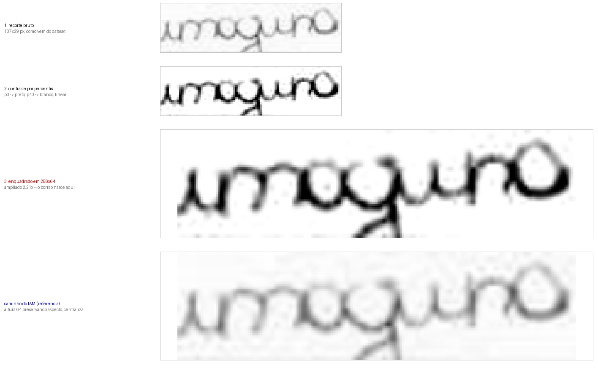

# Pré-processamento

Como uma imagem do BRESSAY vira o alvo que o DiffusionPen tenta reproduzir.
Código em `diffusionpen_mods/utils/bressay_dataset.py`, função `load_image`.

## As quatro etapas

| # | o que faz | onde |
|---|---|---|
| 1 | Lê o PNG recortado do dataset | `Image.open(...).convert("RGB")` |
| 2 | Estica o contraste por percentis | percentil 3 vira preto, percentil 40 vira branco |
| 3 | Enquadra em 256×64 | `ImageOps.pad`, preservando o aspecto |
| 4 | Converte em tensor | `ToTensor` + `Normalize(0.5, 0.5)`, faixa [−1, 1] |

Depois disso o VAE do Stable Diffusion comprime a imagem 8× e o modelo trabalha
num latente de 4×8×32. As 5 imagens de estilo de cada amostra passam pelo mesmo
caminho.

### Etapa 2

Toma o percentil 3 dos cinzas, que é a tinta mais escura, e manda para preto.
Toma o percentil 40, que é o papel, e manda para branco. Estica linearmente
entre os dois. O 40 funciona como papel porque a tinta ocupa cerca de 25% dos
pixels de um recorte.

Os cinzas intermediários sobrevivem. A escolha herda do IAM, cujas imagens o
modelo pré-treinado viu em tons de cinza. A comparação com Otsu nos mesmos
recortes está em `../diagnostico/resultados/dados/normalizacao_vs_otsu.png`.

### Etapa 3

O modelo trabalha em 256×64. Os recortes do BRESSAY chegam com 31 px de altura
(mediana) e precisam ser ampliados 2,06×. Os do IAM chegam com 70 px e são
reduzidos 0,91×. Ampliar não cria informação, então o borrão do alvo já existe
antes de o treino começar.

Não há subconjunto nítido para o qual filtrar. Das 74.882 amostras de treino,
sobram 3.299 acima de 40 px, 97 acima de 56 px e 1 acima de 64 px. Os recortes
das 110 páginas de alta resolução também têm 32 px, porque as palavras foram
reduzidas a um tamanho uniforme quando o dataset foi cortado, e o BRESSAY não
publica as coordenadas das caixas.

## A linha pautada

73% dos alvos de treino têm a linha do caderno atravessando a imagem de ponta a
ponta. Não é tinta do escritor e o modelo aprende a desenhá-la, então ela
aparece embaixo de quase toda palavra gerada.

## O que foi descartado antes do split

O `scripts/preparar_split.py` cortou 288.152 das 416.826 palavras. Foram 234.007
só por terem altura menor que 28 px, 47.556 por terem menos de duas letras,
6.169 por marcação de ilegibilidade e 420 por pouca tinta.

O corte de altura está quase em cima da mediana da distribuição, que é 31 px.
É um limiar sobre um contínuo, não uma separação entre bom e ruim.

Sobraram 74.882 de treino, 23.539 de validação e 30.253 de teste, disjuntos por
escritor. Destes, 10,1% têm algum diacrítico, sendo 2.538 com `ã` e 1.576 com
`ç`, mas só 113 com `â`.

## Pontos para discutir

1. O teto de nitidez é do dado, não do treino. Nenhuma taxa de aprendizado ou
   número de épocas produz nitidez a partir de um alvo ampliado 2×. O critério
   de sucesso deveria ser o diacrítico aparecer, não a imagem ficar bonita.
2. Remover a pauta do alvo de treino, já que hoje o modelo a aprende.
3. Baixar o corte de altura de 28 para cerca de 22 triplicaria o conjunto. Não
   deve melhorar a legibilidade, mas melhoraria a cobertura de diacríticos
   raros.
